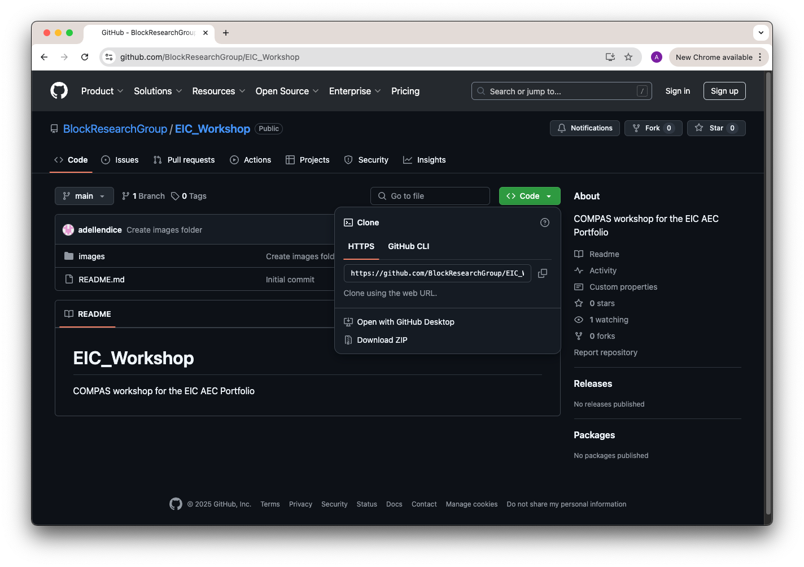

# EIC_Workshop
COMPAS workshop for the EIC AEC Portfolio

**Location**
Online on Zoom, link: [Join meeting](https://ethz.zoom.us/j/63964504836)

**Date**
* Wednesday 12th March 2025

**Tentative Schedule**
* 13:00 to 14:00 - COMPAS introduction - Dr. Tom Van Mele
* 14:10 to 15:00 - COMPAS at BRG/VAULTED - Dr. Tom Van Mele
* 15:10 to 16:00 - COMPAS at GKR - Gonzalo Casas
* 16:10 to 17:00 - COMPAS for EIC (CARBCOMN) - Dr. Alessandro Dell'Endice

**Slack**
* :loudspeaker: If you need help, please post a note in the COMPAS EIC Slack workspace on the channel #compas-workshop: [Join Slack](https://join.slack.com/t/compaseicworkshop/shared_invite/zt-314rbf9sm-lHXS1eoAOvN6pFu8~ii4ag)
  
&nbsp;

:exclamation: **Attention: Please install all software, before the workshop** :exclamation:
* [Part 1 - Requirements](#part-1---requirements)
* [Part 2 - Repository](#part-2---repository)

## Part 1 - Requirements

* Minimum OS: Windows 10 Pro or Mac OS Sierra 10.12
* [Miniforge](https://conda-forge.org/download/), or if unfamiliar install [Anaconda](https://www.anaconda.com/)/[Miniconda](https://www.anaconda.com/docs/getting-started/miniconda/install)
* [Visual Studio Code](https://code.visualstudio.com/) with the `Python` and `Pylance` extensions from Microsoft.
* [Rhino 8](https://www.rhino3d.com/download)
* [Blender](https://www.blender.org/download/) (Optional)

We recommend to use all the proposed default settings when installing the software above.

## Part 2 - Repository
If familiar with GitHub, clone the repository and pull the latest updates the morning before the workshop. 

Otherwise, you can download the repository from GitHub by clicking on the green button Code and then on Download Zip at the bottom of the menu, the morning before the workshop (see image below).

The installation will be done together during the workshop!
